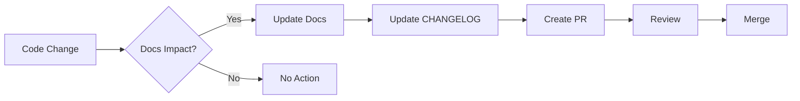

# Documentation Maintenance Guide

This guide outlines how to maintain and update the Retail Intelligence Platform documentation to ensure it remains accurate, comprehensive, and helpful.

## Documentation Philosophy

Our documentation should be:
- **Accurate**: Always reflect the current state of the platform
- **Complete**: Cover all features and use cases
- **Clear**: Easy to understand for the target audience
- **Practical**: Include real-world examples and use cases
- **Maintained**: Updated with every relevant change

## Documentation Structure

```
docs/
├── README.md                 # Documentation index
├── MAINTAINING_DOCS.md       # This file
├── api/                      # API reference documentation
│   ├── README.md            # API overview
│   ├── authentication.md    # Auth endpoints
│   ├── people-counting.md   # Sensor data endpoints
│   └── ...                  # Other API sections
├── architecture/            # Technical architecture
│   ├── overview.md         # System design
│   ├── database.md         # Data models
│   └── ...                 # Architecture details
├── deployment/             # Deployment guides
│   ├── README.md          # Deployment overview
│   ├── environments.md    # Environment setup
│   └── ...               # Deployment topics
├── development/          # Developer guides
│   ├── setup.md         # Dev environment
│   ├── testing.md       # Testing guide
│   └── ...             # Dev topics
├── guides/             # User guides
│   ├── getting-started.md  # Quick start
│   ├── dashboard.md        # Using the UI
│   └── ...                # User topics
├── modules/               # Feature documentation
│   ├── people-counting.md # Module guides
│   └── ...               # Other modules
├── operations/           # Ops guides
│   ├── monitoring.md    # Monitoring setup
│   ├── backup.md        # Backup procedures
│   └── ...             # Ops topics
└── security/           # Security docs
    ├── README.md      # Security overview
    └── ...           # Security topics
```

## When to Update Documentation

### Required Updates

Documentation MUST be updated when:

1. **New Features Added**
   - Document the feature in appropriate module guide
   - Update API documentation if applicable
   - Add to changelog
   - Update getting started guide if it's a core feature

2. **API Changes**
   - Update endpoint documentation
   - Document breaking changes prominently
   - Update code examples
   - Add migration guide if needed

3. **Configuration Changes**
   - Update environment variable documentation
   - Update deployment guides
   - Document new options

4. **Security Updates**
   - Update security documentation
   - Document new procedures
   - Update compliance information

5. **Bug Fixes**
   - Update troubleshooting guides
   - Document workarounds if applicable

### Documentation Update Process



## Documentation Standards

### Writing Style

1. **Voice and Tone**
   - Use active voice: "Configure the API" not "The API should be configured"
   - Be direct and concise
   - Use "you" to address the reader
   - Be friendly but professional

2. **Structure**
   - Start with an overview
   - Use clear headings (H2, H3)
   - Include a table of contents for long documents
   - End with next steps or related topics

3. **Examples**
   ```markdown
   ## Good Example
   
   To create a new site, send a POST request to `/api/sites`:
   
   ```bash
   curl -X POST https://api.retailintelligence.io/v1/sites \
     -H "Authorization: Bearer YOUR_TOKEN" \
     -H "Content-Type: application/json" \
     -d '{"name": "Downtown Store", "type": "retail"}'
   ```
   ```

### Code Examples

1. **Complete and Runnable**
   ```typescript
   // ✅ Good - Complete example
   import { createClient } from '@supabase/supabase-js';
   
   const supabase = createClient(
     process.env.NEXT_PUBLIC_SUPABASE_URL!,
     process.env.NEXT_PUBLIC_SUPABASE_ANON_KEY!
   );
   
   async function getMetrics() {
     const { data, error } = await supabase
       .from('metrics')
       .select('*');
       
     if (error) throw error;
     return data;
   }
   
   // ❌ Bad - Incomplete example
   // Just call supabase.from('metrics').select()
   ```

2. **Error Handling**
   Always show error handling in examples

3. **Real-World Usage**
   Use realistic data and scenarios

### Versioning Documentation

1. **API Versions**
   - Maintain docs for all supported versions
   - Clearly mark deprecated features
   - Provide migration guides

2. **Platform Versions**
   - Tag documentation with platform version
   - Maintain historical documentation
   - Use version selectors in docs site

## Documentation Tools

### Markdown Linting

```bash
# Install markdownlint
npm install -g markdownlint-cli

# Lint all markdown files
markdownlint docs/**/*.md

# Auto-fix issues
markdownlint --fix docs/**/*.md
```

### Link Checking

```bash
# Install markdown-link-check
npm install -g markdown-link-check

# Check all links
find docs -name "*.md" -exec markdown-link-check {} \;
```

### Spell Checking

```bash
# Using cspell
npm install -g cspell

# Check spelling
cspell "docs/**/*.md"
```

## Documentation Review Checklist

### Before Committing

- [ ] Spell check passed
- [ ] Links verified
- [ ] Code examples tested
- [ ] Screenshots updated (if UI changed)
- [ ] Version numbers updated
- [ ] Changelog updated

### PR Review

- [ ] Technical accuracy verified
- [ ] Follows documentation standards
- [ ] Examples are complete and working
- [ ] No broken links
- [ ] Appropriate for target audience

## Automated Documentation

### API Documentation

Generate from OpenAPI spec:
```bash
npm run docs:generate-api
```

### TypeScript Documentation

Generate from code comments:
```bash
npm run docs:generate-ts
```

### Database Documentation

Generate from schema:
```bash
npm run docs:generate-db
```

## Documentation Metrics

Track documentation quality:

1. **Coverage**
   - All features documented
   - All APIs documented
   - All error codes documented

2. **Freshness**
   - Last updated dates
   - Stale content alerts
   - Review schedules

3. **Usage**
   - Page views
   - Search queries
   - User feedback

## Common Documentation Tasks

### Adding a New Feature

1. Create feature documentation in `docs/modules/`
2. Update relevant API docs
3. Add to getting started if applicable
4. Update architecture docs if needed
5. Add examples
6. Update changelog

### Documenting an API Endpoint

```markdown
## Get Store Metrics

Retrieves metrics for a specific store.

### Request

`GET /api/v1/sites/{siteId}/metrics`

#### Parameters

| Name | Type | Required | Description |
|------|------|----------|-------------|
| siteId | string | Yes | The site identifier |
| date | string | No | Date in YYYY-MM-DD format |

#### Headers

| Name | Required | Description |
|------|----------|-------------|
| Authorization | Yes | Bearer token |

### Response

```json
{
  "data": {
    "footfall": 1250,
    "revenue": 25000,
    "conversion": 0.15
  }
}
```

### Examples

```bash
curl -X GET https://api.retailintelligence.io/v1/sites/123/metrics \
  -H "Authorization: Bearer YOUR_TOKEN"
```

### Error Codes

| Code | Description |
|------|-------------|
| 404 | Site not found |
| 403 | Insufficient permissions |
```

### Creating a Guide

1. **Identify the Audience**
   - Developer, User, or Operator?
   - Skill level?

2. **Structure the Guide**
   - Overview
   - Prerequisites
   - Step-by-step instructions
   - Troubleshooting
   - Next steps

3. **Include Visuals**
   - Screenshots for UI guides
   - Diagrams for architecture
   - Code examples for developers

## Documentation Emergency Procedures

### Critical Documentation Fixes

For urgent documentation fixes (security issues, major errors):

1. Create hotfix branch
2. Make minimal necessary changes
3. Fast-track review
4. Deploy immediately
5. Backport to other versions

### Documentation Rollback

If documentation causes issues:

1. Revert the problematic commit
2. Deploy previous version
3. Investigate and fix
4. Re-deploy with fixes

## Getting Help

### Documentation Questions

- Slack: #documentation
- Email: docs@retailintelligence.io

### Documentation Contributions

See [CONTRIBUTING.md](../CONTRIBUTING.md) for how to contribute to documentation.

---

Remember: Good documentation is as important as good code. It's how users and developers understand and succeed with our platform.