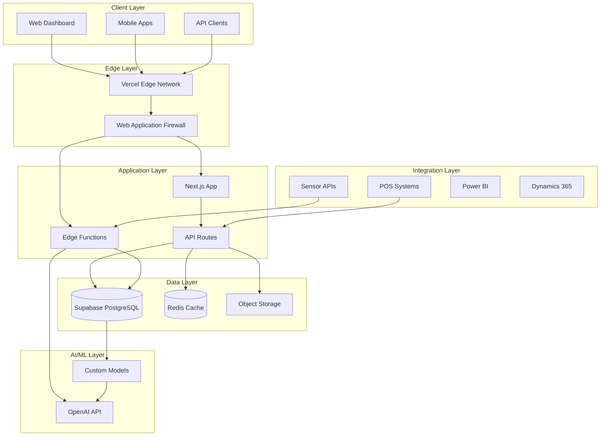
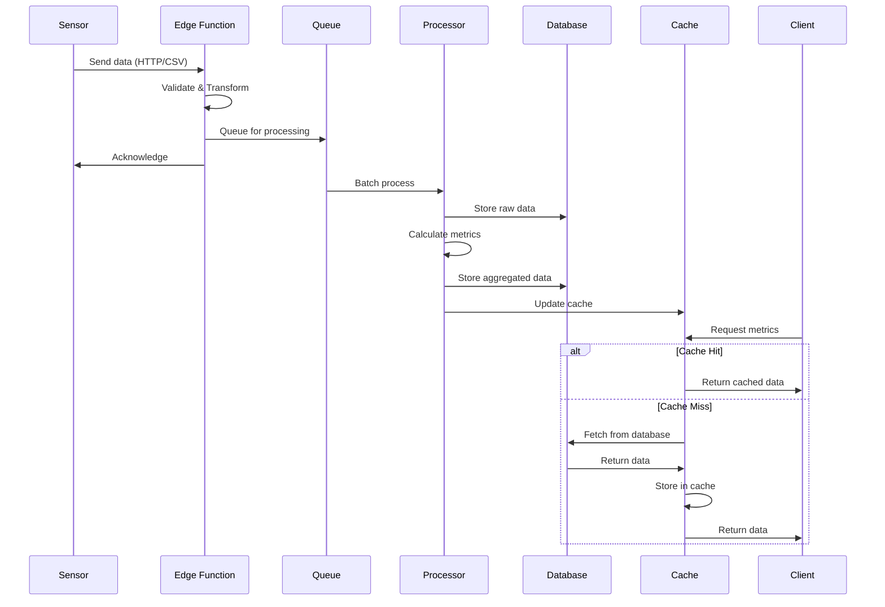

# Architecture Overview

## System Architecture

The Retail Intelligence Platform follows a modern, cloud-native architecture designed for scalability, reliability, and performance.

## High-Level Architecture



## Component Architecture

### Frontend Architecture

```typescript
// Next.js 14 App Router Structure
app/
├── (auth)/
│   ├── login/
│   ├── register/
│   └── layout.tsx
├── (dashboard)/
│   ├── analytics/
│   ├── sites/
│   ├── reports/
│   └── layout.tsx
├── api/
│   ├── auth/
│   ├── metrics/
│   ├── sensors/
│   └── webhooks/
└── components/
    ├── ui/
    ├── charts/
    └── layouts/
```

### Backend Services

```yaml
services:
  # Core Services
  - name: Authentication Service
    type: Supabase Auth
    responsibilities:
      - User authentication
      - Session management
      - MFA handling
      - SSO integration
      
  - name: Tenant Service
    type: Edge Function
    responsibilities:
      - Organization management
      - User provisioning
      - Billing integration
      - Feature flags
      
  - name: Analytics Engine
    type: Vercel Functions
    responsibilities:
      - Metric calculations
      - Aggregations
      - Real-time processing
      - Cache management
      
  - name: AI Service
    type: Edge Function
    responsibilities:
      - Predictions
      - Insights generation
      - Anomaly detection
      - Recommendations
```

### Data Flow Architecture



## Technology Stack

### Frontend Technologies

```yaml
framework: Next.js 14
ui_library: React 18
styling: 
  - Tailwind CSS
  - shadcn/ui components
state_management:
  - Zustand (client state)
  - React Query (server state)
charts: 
  - Recharts
  - D3.js
forms: React Hook Form + Zod
animations: Framer Motion
```

### Backend Technologies

```yaml
runtime: Node.js 20
database: 
  primary: PostgreSQL (Supabase)
  cache: Redis (Upstash)
  timeseries: TimescaleDB extension
  
api:
  rest: Next.js API Routes
  graphql: GraphQL Yoga
  realtime: Supabase Realtime
  
queue: Bull (Redis-based)
storage: Supabase Storage + AWS S3
search: PostgreSQL Full Text + pgvector
```

### Infrastructure

```yaml
hosting:
  frontend: Vercel
  database: Supabase
  cache: Upstash
  
cdn: Vercel Edge Network
dns: Cloudflare
monitoring: 
  - Vercel Analytics
  - Sentry
  - New Relic
  
ci_cd: GitHub Actions
container_registry: GitHub Container Registry
secrets_management: Vercel Environment Variables
```

## Database Architecture

### Schema Design

```sql
-- Multi-tenant structure with RLS
CREATE SCHEMA IF NOT EXISTS public;

-- Core tables
CREATE TABLE organizations (
    id UUID PRIMARY KEY DEFAULT gen_random_uuid(),
    name TEXT NOT NULL,
    slug TEXT UNIQUE NOT NULL,
    -- ... other fields
);

CREATE TABLE users (
    id UUID PRIMARY KEY DEFAULT auth.uid(),
    email TEXT UNIQUE NOT NULL,
    -- ... other fields
);

CREATE TABLE organization_members (
    organization_id UUID REFERENCES organizations(id),
    user_id UUID REFERENCES users(id),
    role TEXT NOT NULL,
    PRIMARY KEY (organization_id, user_id)
);

-- Enable RLS
ALTER TABLE organizations ENABLE ROW LEVEL SECURITY;
ALTER TABLE sites ENABLE ROW LEVEL SECURITY;

-- RLS Policies
CREATE POLICY "Users can view their organization"
ON organizations FOR SELECT
USING (
    EXISTS (
        SELECT 1 FROM organization_members
        WHERE organization_id = organizations.id
        AND user_id = auth.uid()
    )
);
```

### Data Partitioning Strategy

```sql
-- Partition people_counts by month
CREATE TABLE people_counts (
    id UUID DEFAULT gen_random_uuid(),
    site_id UUID NOT NULL,
    timestamp TIMESTAMPTZ NOT NULL,
    entries INTEGER,
    exits INTEGER,
    PRIMARY KEY (id, timestamp)
) PARTITION BY RANGE (timestamp);

-- Create monthly partitions
CREATE TABLE people_counts_2025_01 
PARTITION OF people_counts
FOR VALUES FROM ('2025-01-01') TO ('2025-02-01');

-- Automated partition management
CREATE OR REPLACE FUNCTION create_monthly_partition()
RETURNS void AS $$
DECLARE
    start_date date;
    end_date date;
    partition_name text;
BEGIN
    start_date := date_trunc('month', CURRENT_DATE + interval '1 month');
    end_date := start_date + interval '1 month';
    partition_name := 'people_counts_' || to_char(start_date, 'YYYY_MM');
    
    EXECUTE format(
        'CREATE TABLE IF NOT EXISTS %I PARTITION OF people_counts FOR VALUES FROM (%L) TO (%L)',
        partition_name, start_date, end_date
    );
END;
$$ LANGUAGE plpgsql;
```

### Indexing Strategy

```sql
-- Performance indexes
CREATE INDEX idx_people_counts_site_time 
ON people_counts (site_id, timestamp DESC);

CREATE INDEX idx_transactions_site_date 
ON transactions (site_id, timestamp::date DESC);

-- Full text search
CREATE INDEX idx_sites_search 
ON sites USING gin(to_tsvector('english', name || ' ' || address));

-- JSONB indexes
CREATE INDEX idx_sites_metadata 
ON sites USING gin(metadata);
```

## API Architecture

### RESTful API Design

```typescript
// API Route Structure
app/api/
├── v1/
│   ├── auth/
│   │   ├── login/route.ts
│   │   ├── logout/route.ts
│   │   └── refresh/route.ts
│   ├── organizations/
│   │   ├── route.ts
│   │   └── [id]/
│   │       ├── route.ts
│   │       └── members/route.ts
│   ├── sites/
│   │   ├── route.ts
│   │   └── [id]/
│   │       ├── route.ts
│   │       ├── metrics/route.ts
│   │       └── occupancy/route.ts
│   └── middleware.ts
```

### API Versioning Strategy

```typescript
// Version negotiation
export function getAPIVersion(request: Request): string {
  // 1. Check header
  const headerVersion = request.headers.get('X-API-Version');
  if (headerVersion) return headerVersion;
  
  // 2. Check URL path
  const url = new URL(request.url);
  const pathMatch = url.pathname.match(/\/api\/v(\d+)/);
  if (pathMatch) return pathMatch[1];
  
  // 3. Default to latest
  return '1';
}

// Version-specific handlers
const handlers = {
  '1': handleV1Request,
  '2': handleV2Request
};
```

### GraphQL Schema

```graphql
type Query {
  # Organization queries
  organization(id: ID!): Organization
  organizations(filter: OrganizationFilter): [Organization!]!
  
  # Site queries
  site(id: ID!): Site
  sites(organizationId: ID!): [Site!]!
  
  # Metrics queries
  metrics(
    siteId: ID!
    startDate: DateTime!
    endDate: DateTime!
    granularity: Granularity
  ): MetricsData!
  
  # Real-time data
  currentOccupancy(siteId: ID!): OccupancyData!
}

type Mutation {
  # Auth mutations
  login(email: String!, password: String!): AuthPayload!
  logout: Boolean!
  
  # Organization mutations
  createOrganization(input: CreateOrganizationInput!): Organization!
  updateOrganization(id: ID!, input: UpdateOrganizationInput!): Organization!
  
  # Target mutations
  createTarget(input: CreateTargetInput!): Target!
  cascadeTargets(parentId: ID!, method: CascadeMethod!): [Target!]!
}

type Subscription {
  # Real-time updates
  occupancyUpdates(siteId: ID!): OccupancyData!
  metricsUpdates(siteId: ID!): MetricsUpdate!
  alertTriggered(organizationId: ID!): Alert!
}
```

## Scaling Architecture

### Horizontal Scaling

```yaml
scaling_strategy:
  web_tier:
    - Auto-scaling based on CPU/Memory
    - Geographic distribution via Vercel Edge
    - Static asset caching
    
  api_tier:
    - Serverless functions (auto-scale)
    - Connection pooling for database
    - Rate limiting per tenant
    
  database_tier:
    - Read replicas for analytics
    - Connection pooling (PgBouncer)
    - Query optimization
    
  cache_tier:
    - Redis cluster mode
    - Cache warming strategies
    - TTL-based eviction
```

### Performance Optimization

```typescript
// 1. Database query optimization
export async function getStoreMetrics(storeId: string, date: Date) {
  // Use materialized view for performance
  const { data } = await supabase
    .from('daily_metrics_mv')
    .select('*')
    .eq('site_id', storeId)
    .eq('date', date)
    .single();
    
  return data;
}

// 2. Caching strategy
export async function getCachedMetrics(storeId: string, date: Date) {
  const cacheKey = `metrics:${storeId}:${date}`;
  
  // Try cache first
  const cached = await redis.get(cacheKey);
  if (cached) return JSON.parse(cached);
  
  // Fetch from database
  const data = await getStoreMetrics(storeId, date);
  
  // Cache for 1 hour
  await redis.setex(cacheKey, 3600, JSON.stringify(data));
  
  return data;
}

// 3. Request deduplication
const inFlightRequests = new Map();

export async function deduplicatedFetch(key: string, fetcher: () => Promise<any>) {
  if (inFlightRequests.has(key)) {
    return inFlightRequests.get(key);
  }
  
  const promise = fetcher();
  inFlightRequests.set(key, promise);
  
  try {
    const result = await promise;
    return result;
  } finally {
    inFlightRequests.delete(key);
  }
}
```

## Monitoring & Observability

### Metrics Collection

```typescript
// Custom metrics
export const metrics = {
  apiRequestDuration: new Histogram({
    name: 'api_request_duration_seconds',
    help: 'API request duration in seconds',
    labelNames: ['method', 'route', 'status']
  }),
  
  activeUsers: new Gauge({
    name: 'active_users_total',
    help: 'Total number of active users',
    labelNames: ['organization']
  }),
  
  dataIngestionRate: new Counter({
    name: 'data_ingestion_total',
    help: 'Total data points ingested',
    labelNames: ['source', 'site']
  })
};

// Middleware to collect metrics
export function metricsMiddleware(request: Request) {
  const start = Date.now();
  
  return new Response(null, {
    status: 200,
    headers: {
      'X-Response-Time': `${Date.now() - start}ms`
    }
  });
}
```

### Distributed Tracing

```typescript
// OpenTelemetry setup
import { NodeTracerProvider } from '@opentelemetry/sdk-trace-node';
import { Resource } from '@opentelemetry/resources';
import { SemanticResourceAttributes } from '@opentelemetry/semantic-conventions';

const provider = new NodeTracerProvider({
  resource: new Resource({
    [SemanticResourceAttributes.SERVICE_NAME]: 'retail-intelligence',
    [SemanticResourceAttributes.SERVICE_VERSION]: process.env.APP_VERSION
  })
});

// Trace database queries
export async function tracedQuery(name: string, query: () => Promise<any>) {
  const span = tracer.startSpan(name);
  
  try {
    span.setAttributes({
      'db.system': 'postgresql',
      'db.operation': name
    });
    
    const result = await query();
    span.setStatus({ code: SpanStatusCode.OK });
    return result;
  } catch (error) {
    span.recordException(error);
    span.setStatus({ code: SpanStatusCode.ERROR });
    throw error;
  } finally {
    span.end();
  }
}
```

## Disaster Recovery

### Backup Strategy

```yaml
backup_strategy:
  database:
    - Continuous WAL archiving
    - Daily full backups
    - Point-in-time recovery (up to 7 days)
    - Cross-region replication
    
  application_data:
    - Version control for code
    - Environment variable backups
    - Configuration snapshots
    
  user_uploads:
    - S3 versioning enabled
    - Cross-region replication
    - 30-day retention
```

### Recovery Procedures

```typescript
// Automated failover
export class DisasterRecovery {
  async detectFailure(): Promise<boolean> {
    const healthChecks = await Promise.allSettled([
      this.checkDatabase(),
      this.checkAPI(),
      this.checkCache()
    ]);
    
    return healthChecks.some(check => check.status === 'rejected');
  }
  
  async initiateFailover() {
    // 1. Switch to read replica
    await this.promoteReadReplica();
    
    // 2. Update DNS
    await this.updateDNS('dr.retailintelligence.io');
    
    // 3. Notify team
    await this.notifyOncall('Failover initiated');
    
    // 4. Start recovery
    await this.startRecoveryProcess();
  }
}
```

## Future Architecture Considerations

### Planned Improvements

1. **Event-Driven Architecture**
   - Apache Kafka for event streaming
   - Event sourcing for audit trail
   - CQRS for read/write separation

2. **Microservices Migration**
   - Decompose monolith into services
   - Service mesh (Istio/Linkerd)
   - Container orchestration (K8s)

3. **Enhanced AI/ML Pipeline**
   - MLOps platform
   - Model versioning
   - A/B testing framework

4. **Global Distribution**
   - Multi-region deployment
   - Edge computing for sensors
   - Global data replication

---

For architecture questions or proposals, contact architecture@retailintelligence.io