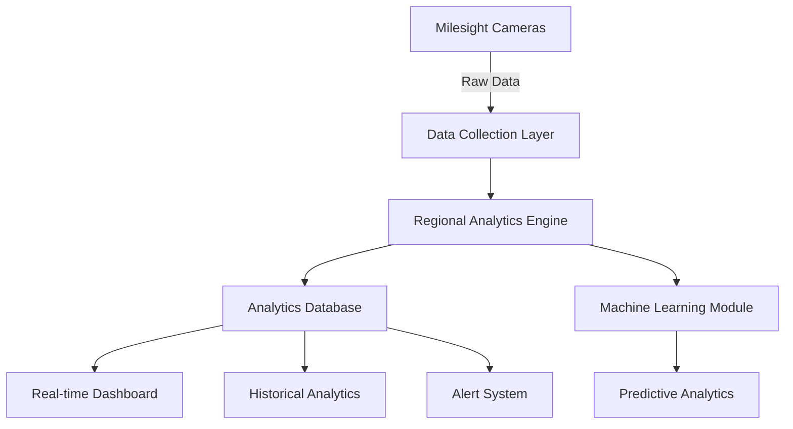

# Regional Analytics System - Implementation Guide

## Overview

This document outlines a flexible, store-agnostic regional analytics system that leverages Milesight cameras' regional counting and entrance/exit features. The system is designed to work with any retail environment, regardless of size, layout, or business type.

## Table of Contents

1. [System Architecture](#system-architecture)
2. [Region Configuration Framework](#region-configuration-framework)
3. [Analytics Modules](#analytics-modules)
4. [Implementation Plan](#implementation-plan)
5. [Dashboard Design](#dashboard-design)
6. [API Specifications](#api-specifications)

## System Architecture

### Core Components



### Data Flow

1. **Raw Data Collection**: Regional counts, entrance/exit events
2. **Processing**: Real-time aggregation and calculation
3. **Storage**: Time-series database with efficient querying
4. **Analysis**: Both real-time and historical analytics
5. **Visualization**: Adaptive dashboards for different store types

## Region Configuration Framework

### Dynamic Region Types

Each store can define custom region types based on their business model:

```typescript
interface RegionType {
  id: string
  name: string
  category: 'entrance' | 'shopping' | 'service' | 'transition' | 'custom'
  businessPurpose: string
  metricsToTrack: string[]
  alertThresholds: AlertConfig
  visualProperties: VisualizationConfig
}

// Example configurations for different store types
const regionTypeLibrary = {
  // Retail Store
  retail: [
    {
      id: 'retail_entrance',
      name: 'Store Entrance',
      category: 'entrance',
      businessPurpose: 'Track customer entry and initial impressions',
      metricsToTrack: ['entries', 'exits', 'bounce_rate', 'peak_hours'],
      alertThresholds: {
        maxOccupancy: 50,
        minDwellTime: 10, // seconds
        maxDwellTime: 300 // 5 minutes
      }
    },
    {
      id: 'retail_premium',
      name: 'Premium Products',
      category: 'shopping',
      businessPurpose: 'High-value product area requiring attention',
      metricsToTrack: ['dwell_time', 'consideration_rate', 'staff_interactions'],
      alertThresholds: {
        minDwellTime: 60, // 1 minute shows interest
        unmannedDuration: 300 // Alert if no staff for 5 minutes
      }
    }
  ],
  
  // Supermarket
  supermarket: [
    {
      id: 'super_produce',
      name: 'Fresh Produce',
      category: 'shopping',
      businessPurpose: 'High-turnover area requiring freshness monitoring',
      metricsToTrack: ['throughput', 'peak_times', 'average_selection_time']
    },
    {
      id: 'super_checkout',
      name: 'Checkout Queues',
      category: 'service',
      businessPurpose: 'Queue management and cashier optimization',
      metricsToTrack: ['queue_length', 'wait_time', 'abandonment_rate', 'service_rate']
    }
  ],
  
  // Restaurant/Cafe
  restaurant: [
    {
      id: 'rest_waiting',
      name: 'Waiting Area',
      category: 'transition',
      businessPurpose: 'Monitor wait times and seating efficiency',
      metricsToTrack: ['wait_time', 'party_size', 'abandonment_rate']
    },
    {
      id: 'rest_dining',
      name: 'Dining Area',
      category: 'service',
      businessPurpose: 'Table turnover and service quality',
      metricsToTrack: ['table_occupancy', 'dining_duration', 'service_frequency']
    }
  ]
}
```

### Flexible Region Mapping

```typescript
interface RegionConfiguration {
  sensorId: string
  storeId: string
  regions: Region[]
  relationships: RegionRelationship[]
  businessRules: BusinessRule[]
}

interface Region {
  regionNumber: number // Physical region on camera (1-4)
  regionType: string // References regionTypeLibrary
  customName?: string // Store-specific name
  physicalLocation: {
    floor?: number
    department?: string
    coordinates?: GeoJSON
  }
  capacity?: number
  staffingRequirements?: StaffingRule
}

interface RegionRelationship {
  from: number
  to: number
  relationshipType: 'adjacent' | 'pathway' | 'visible' | 'alternative'
  expectedFlow: 'high' | 'medium' | 'low'
  conversionSignal?: boolean // Moving from A to B indicates purchase intent
}
```

## Analytics Modules

### 1. Real-time Occupancy Module

```typescript
class OccupancyAnalytics {
  calculateCurrentOccupancy(regionId: number): OccupancyMetrics {
    return {
      currentCount: entrances - exits,
      occupancyRate: currentCount / capacity,
      trend: this.calculateTrend(historicalData),
      predictedPeak: this.predictNextPeak(historicalPatterns),
      recommendations: this.generateRecommendations(occupancyRate)
    }
  }
  
  generateRecommendations(occupancyRate: number): string[] {
    const recommendations = []
    
    if (occupancyRate > 0.8) {
      recommendations.push('Open additional service points')
      recommendations.push('Deploy crowd management staff')
    } else if (occupancyRate < 0.2) {
      recommendations.push('Opportunity for promotions to drive traffic')
      recommendations.push('Consider reducing active service points')
    }
    
    return recommendations
  }
}
```

### 2. Flow Analytics Module

```typescript
class FlowAnalytics {
  analyzeCustomerJourneys(timeWindow: TimeRange): JourneyInsights {
    const journeys = this.extractJourneys(entranceExitData)
    
    return {
      commonPaths: this.identifyCommonPaths(journeys),
      conversionFunnels: this.buildConversionFunnels(journeys),
      bottlenecks: this.identifyBottlenecks(journeys),
      optimalPath: this.calculateOptimalPath(journeys),
      deviations: this.findPathDeviations(journeys)
    }
  }
  
  identifyBottlenecks(journeys: Journey[]): Bottleneck[] {
    // Identify regions where entry rate > exit rate consistently
    // Calculate wait times and queue formation
    return regions.map(region => ({
      regionId: region.id,
      severity: this.calculateBottleneckSeverity(region),
      peakTimes: this.findPeakCongestion(region),
      estimatedDelay: this.estimateCustomerDelay(region),
      suggestedActions: this.generateBottleneckSolutions(region)
    }))
  }
}
```

### 3. Conversion Analytics Module

```typescript
class ConversionAnalytics {
  calculateRegionalConversion(config: ConversionConfig): ConversionMetrics {
    // Flexible conversion definition based on store type
    const conversions = this.identifyConversions(config.conversionRules)
    
    return {
      overallConversion: conversions.count / totalVisitors,
      regionalConversions: this.calculateByRegion(conversions),
      pathConversions: this.analyzePathEffectiveness(conversions),
      timeBasedConversion: this.analyzeByTimeOfDay(conversions),
      correlations: this.findConversionCorrelations(conversions)
    }
  }
  
  // Adaptive conversion rules
  conversionRules = {
    retail: (journey) => journey.includes('checkout'),
    restaurant: (journey) => journey.includes('dining_area'),
    service: (journey) => journey.dwellTime > config.serviceTime,
    showroom: (journey) => journey.interactions > config.engagementThreshold
  }
}
```

### 4. Predictive Analytics Module

```typescript
class PredictiveAnalytics {
  predictRegionalDemand(region: Region, timeHorizon: number): Prediction {
    const features = this.extractFeatures(region)
    const model = this.selectModel(region.type)
    
    return {
      predictedOccupancy: model.predict(features),
      confidence: model.confidence,
      factors: this.explainPrediction(model, features),
      recommendations: this.generateProactiveActions(prediction)
    }
  }
  
  generateStaffingRecommendations(): StaffingPlan {
    const predictions = regions.map(r => this.predictRegionalDemand(r, 4))
    
    return {
      immediate: this.calculateImmediateNeeds(predictions),
      nextHour: this.calculateHourlyNeeds(predictions),
      shiftPlan: this.optimizeShiftSchedule(predictions),
      alerts: this.generateStaffingAlerts(predictions)
    }
  }
}
```

### 5. Heat Map Generation Module

```typescript
class HeatMapAnalytics {
  generateDynamicHeatMap(timeRange: TimeRange): HeatMapData {
    // Adaptive heat map based on store layout
    const regionActivities = this.aggregateRegionalActivity(timeRange)
    
    return {
      intensity: this.calculateIntensityMatrix(regionActivities),
      type: this.selectHeatMapType(storeConfig), // 2D, 3D, temporal
      overlays: this.generateOverlays(regionActivities),
      animations: this.createTemporalAnimation(regionActivities),
      insights: this.extractHeatMapInsights(regionActivities)
    }
  }
  
  generateBusinessHeatMap(metric: BusinessMetric): HeatMapData {
    // Heat maps for business metrics, not just traffic
    switch(metric) {
      case 'revenue_per_sqm':
        return this.generateRevenueHeatMap()
      case 'conversion_rate':
        return this.generateConversionHeatMap()
      case 'staff_efficiency':
        return this.generateStaffEfficiencyHeatMap()
      case 'customer_satisfaction':
        return this.generateSatisfactionHeatMap()
    }
  }
}
```

## Implementation Plan

### Phase 1: Foundation (Week 1-2)

1. **Database Schema Updates**
```sql
-- Flexible region configuration
CREATE TABLE region_configurations (
    id UUID PRIMARY KEY,
    store_id UUID REFERENCES stores(id),
    sensor_id UUID REFERENCES sensor_metadata(id),
    region_number INTEGER,
    region_type VARCHAR(50),
    region_name VARCHAR(255),
    business_purpose TEXT,
    capacity INTEGER,
    physical_location JSONB,
    custom_properties JSONB,
    created_at TIMESTAMP DEFAULT NOW(),
    updated_at TIMESTAMP DEFAULT NOW()
);

-- Region entrance/exit events
CREATE TABLE region_entrance_exit_events (
    id UUID PRIMARY KEY,
    sensor_id UUID REFERENCES sensor_metadata(id),
    region_id UUID REFERENCES region_configurations(id),
    event_type VARCHAR(20) CHECK (event_type IN ('entrance', 'exit')),
    timestamp TIMESTAMP NOT NULL,
    person_id VARCHAR(50), -- For journey tracking
    confidence FLOAT,
    metadata JSONB
);

-- Regional analytics aggregates
CREATE TABLE regional_analytics (
    id UUID PRIMARY KEY,
    region_id UUID REFERENCES region_configurations(id),
    time_bucket TIMESTAMP NOT NULL,
    bucket_size VARCHAR(20), -- '1min', '5min', '1hour', '1day'
    metrics JSONB, -- Flexible metrics storage
    created_at TIMESTAMP DEFAULT NOW(),
    UNIQUE(region_id, time_bucket, bucket_size)
);

-- Customer journeys
CREATE TABLE customer_journeys (
    id UUID PRIMARY KEY,
    store_id UUID REFERENCES stores(id),
    journey_id VARCHAR(100) UNIQUE,
    start_time TIMESTAMP,
    end_time TIMESTAMP,
    path JSONB[], -- Array of {region_id, entry_time, exit_time}
    total_duration INTERVAL,
    conversion BOOLEAN,
    journey_type VARCHAR(50),
    metadata JSONB
);
```

2. **API Endpoints**
```typescript
// Region configuration
POST   /api/stores/{storeId}/regions - Configure regions for a store
GET    /api/stores/{storeId}/regions - Get region configuration
PUT    /api/stores/{storeId}/regions/{regionId} - Update region
DELETE /api/stores/{storeId}/regions/{regionId} - Remove region

// Real-time analytics
GET    /api/analytics/regions/{regionId}/occupancy - Current occupancy
GET    /api/analytics/regions/{regionId}/flow - Flow metrics
GET    /api/analytics/stores/{storeId}/heatmap - Heat map data
WS     /api/analytics/regions/stream - Real-time updates

// Historical analytics
GET    /api/analytics/regions/{regionId}/history - Historical data
GET    /api/analytics/stores/{storeId}/journeys - Journey analysis
GET    /api/analytics/regions/{regionId}/patterns - Pattern detection
POST   /api/analytics/regions/{regionId}/predict - Predictions
```

### Phase 2: Core Analytics (Week 3-4)

1. **Real-time Processing Pipeline**
```typescript
class RegionalDataProcessor {
  async processRegionalCount(data: RegionalCountData) {
    // Store raw data
    await this.storeRawData(data)
    
    // Update real-time metrics
    await this.updateRealTimeMetrics(data)
    
    // Check thresholds and generate alerts
    await this.checkAlertConditions(data)
    
    // Update heat map cache
    await this.updateHeatMapCache(data)
    
    // Trigger journey analysis if needed
    if (this.isJourneyEvent(data)) {
      await this.updateJourneyTracking(data)
    }
  }
  
  async processEntranceExit(event: EntranceExitEvent) {
    // Track individual movements
    await this.trackMovement(event)
    
    // Update occupancy
    await this.updateOccupancy(event)
    
    // Calculate dwell time if exit
    if (event.type === 'exit') {
      await this.calculateDwellTime(event)
    }
    
    // Update flow metrics
    await this.updateFlowMetrics(event)
  }
}
```

2. **Analytics Engine**
```typescript
class RegionalAnalyticsEngine {
  constructor(private config: StoreConfiguration) {
    this.initializeModules()
    this.loadMLModels()
    this.setupRealTimeProcessing()
  }
  
  async analyze(timeRange: TimeRange): AnalyticsReport {
    const modules = [
      this.occupancyModule,
      this.flowModule,
      this.conversionModule,
      this.predictiveModule,
      this.heatMapModule
    ]
    
    const results = await Promise.all(
      modules.map(m => m.analyze(timeRange))
    )
    
    return this.combineResults(results)
  }
}
```

### Phase 3: Advanced Features (Week 5-6)

1. **Machine Learning Integration**
```python
class RegionalMLPipeline:
    def __init__(self, store_type):
        self.store_type = store_type
        self.models = self.load_models()
        
    def train_occupancy_predictor(self, historical_data):
        """Train model to predict regional occupancy"""
        features = self.extract_features(historical_data)
        model = self.select_algorithm(features)
        return model.fit(features)
        
    def train_conversion_predictor(self, journey_data):
        """Predict conversion probability based on journey"""
        # Use LSTM for sequence prediction
        return self.lstm_model.fit(journey_data)
        
    def detect_anomalies(self, current_patterns):
        """Detect unusual regional behavior"""
        return self.anomaly_detector.predict(current_patterns)
```

2. **Alert System**
```typescript
class RegionalAlertSystem {
  rules = {
    overcrowding: {
      condition: (region) => region.occupancy > region.capacity * 0.9,
      severity: 'high',
      actions: ['notify_manager', 'suggest_crowd_control']
    },
    
    longQueue: {
      condition: (region) => region.avgWaitTime > 600, // 10 minutes
      severity: 'medium',
      actions: ['notify_staff', 'suggest_additional_cashier']
    },
    
    abandonmentRisk: {
      condition: (region) => region.dwellTime > region.avgDwellTime * 2,
      severity: 'low',
      actions: ['track_customer', 'suggest_assistance']
    }
  }
}
```

## Dashboard Design

### Adaptive Dashboard Components

1. **Regional Overview Widget**
```typescript
interface RegionalOverviewWidget {
  displayMode: 'grid' | 'floorplan' | 'list'
  regions: RegionDisplay[]
  updateInterval: number
  colorScheme: 'occupancy' | 'activity' | 'conversion' | 'custom'
}

interface RegionDisplay {
  id: string
  name: string
  currentOccupancy: number
  occupancyTrend: 'rising' | 'stable' | 'falling'
  alerts: Alert[]
  metrics: {
    primary: MetricDisplay // Main metric based on region type
    secondary: MetricDisplay[] // Supporting metrics
  }
}
```

2. **Flow Visualization**
```typescript
interface FlowVisualization {
  type: 'sankey' | 'directed_graph' | 'animated_particles'
  showMetrics: boolean
  timeRange: TimeRange
  filterOptions: {
    minFlow: number
    showOnlyConversions: boolean
    highlightBottlenecks: boolean
  }
}
```

3. **Predictive Dashboard**
```typescript
interface PredictiveDashboard {
  predictions: {
    nextHour: OccupancyPrediction[]
    peakTimes: PeakPrediction[]
    staffingNeeds: StaffingPrediction[]
  }
  confidence: number
  factors: InfluencingFactor[]
  recommendations: ActionableInsight[]
}
```

### Mobile-Responsive Manager View

```typescript
interface ManagerDashboard {
  summary: {
    storeOccupancy: number
    conversionRate: number
    avgDwellTime: number
    activeAlerts: Alert[]
  }
  
  regions: {
    id: string
    name: string
    status: 'optimal' | 'attention' | 'critical'
    keyMetric: number
    action: string | null
  }[]
  
  insights: {
    hourlyTrend: TrendData
    recommendations: string[]
    predictedIssues: PredictedIssue[]
  }
}
```

## Configuration Examples

### Example 1: Fashion Retail Store

```json
{
  "storeType": "fashion_retail",
  "regions": [
    {
      "regionNumber": 1,
      "name": "Storefront Window",
      "type": "attraction",
      "metrics": ["dwell_time", "capture_rate", "interest_score"],
      "conversionRule": "entrance_after_window_dwell > 30s"
    },
    {
      "regionNumber": 2,
      "name": "New Arrivals",
      "type": "high_value",
      "metrics": ["touch_rate", "consideration_time", "staff_interactions"],
      "alertRules": {
        "unattended": "no_staff_presence > 5min && occupancy > 0"
      }
    },
    {
      "regionNumber": 3,
      "name": "Fitting Rooms",
      "type": "service",
      "metrics": ["queue_length", "usage_rate", "conversion_after_fitting"],
      "capacity": 8
    },
    {
      "regionNumber": 4,
      "name": "Checkout",
      "type": "transaction",
      "metrics": ["queue_time", "transaction_rate", "abandonment"],
      "staffingRule": "dynamic_based_on_queue"
    }
  ]
}
```

### Example 2: Supermarket

```json
{
  "storeType": "supermarket",
  "regions": [
    {
      "regionNumber": 1,
      "name": "Entrance/Promotions",
      "type": "entrance",
      "metrics": ["traffic_flow", "promotion_engagement", "basket_pickup_rate"]
    },
    {
      "regionNumber": 2,
      "name": "Fresh Produce",
      "type": "high_turnover",
      "metrics": ["selection_time", "revisit_rate", "peak_congestion"],
      "businessRules": {
        "restock_alert": "traffic_spike && time_since_restock > 2h"
      }
    },
    {
      "regionNumber": 3,
      "name": "Aisles",
      "type": "browsing",
      "metrics": ["path_efficiency", "category_dwell", "cart_abandonment"]
    },
    {
      "regionNumber": 4,
      "name": "Checkout Lanes",
      "type": "queue",
      "metrics": ["lanes_open", "avg_wait", "items_per_minute"],
      "optimization": "auto_suggest_lanes_based_on_queue"
    }
  ]
}
```

## Success Metrics

### System KPIs

1. **Technical Performance**
   - Data processing latency < 500ms
   - Dashboard refresh rate < 2s
   - Alert generation time < 1s
   - Prediction accuracy > 85%

2. **Business Impact**
   - Conversion rate improvement
   - Average dwell time optimization
   - Queue time reduction
   - Staff efficiency increase

3. **User Adoption**
   - Daily active users
   - Alert response rate
   - Configuration customizations
   - Report generation frequency

## Conclusion

This regional analytics system provides a flexible, scalable foundation that adapts to any retail environment. By combining real-time occupancy data, entrance/exit tracking, and predictive analytics, stores can optimize operations, improve customer experience, and increase conversions.

The system's modular design allows for easy customization while maintaining core analytical capabilities across all implementations.