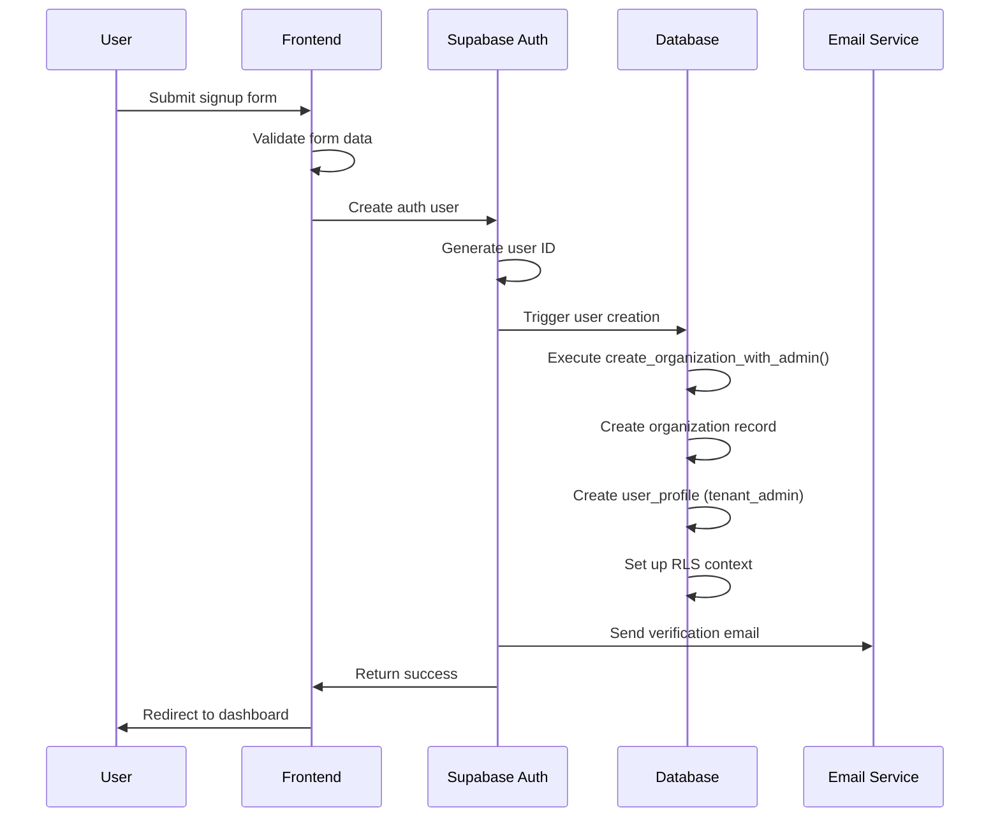

# Multi-Tenant Onboarding Flow

## Overview

This document describes the complete onboarding flow for new organizations (tenants) in the Retail Platform, from signup to first dashboard access.

## User Journey

### 1. Landing Page → Signup

**Entry Points:**
- "Start Free Trial" button on landing page
- "Start free trial" link from signin page
- Direct URL: `/auth/signup`

### 2. Signup Form (Multi-Step Process)

#### Step 1: Organization Information
- **Organization Name**: Company's display name
- **Organization URL**: Unique slug for tenant identification
  - Auto-generated from organization name
  - Format: `blipee.app/[org-slug]`
  - Validation: lowercase, alphanumeric + hyphens only
  - Must be unique across all tenants

#### Step 2: Personal Information
- **Full Name**: Admin user's name
- **Email**: Admin user's email (becomes username)
- **Password**: Minimum 6 characters
- **Confirm Password**: Must match
- **Terms Agreement**: Required checkbox

### 3. Account Creation Process



### 4. Database Operations

When a new tenant signs up, the following happens:

1. **Supabase Auth** creates the authentication user
2. **Database Function** `create_organization_with_admin()`:
   ```sql
   -- Creates organization
   INSERT INTO organizations (name, slug, trial_ends_at)
   VALUES (org_name, org_slug, NOW() + INTERVAL '14 days')
   
   -- Creates admin profile
   INSERT INTO user_profiles (id, organization_id, email, full_name, role)
   VALUES (user_id, org_id, email, full_name, 'tenant_admin')
   ```

3. **Row Level Security** automatically scopes all future queries

### 5. Post-Signup Flow

#### Immediate Actions:
1. User is logged in automatically
2. Redirected to dashboard (role-based)
3. Organization context is set in session

#### First-Time Setup Wizard (Future):
- Welcome message
- Quick tour of features
- Invite team members
- Add first store
- Connect first sensor

## Email Verification

### Current Implementation (MVP):
- Email verification not blocking dashboard access
- Verification email sent automatically by Supabase
- Banner shown in dashboard if email unverified

### Future Enhancement:
- Require email verification for certain actions
- Resend verification option
- Custom email templates per language

## Trial Period Management

### 14-Day Free Trial:
- Starts immediately upon signup
- Full access to all features
- No credit card required

### Trial Tracking:
```sql
-- Organization table includes:
trial_ends_at TIMESTAMP -- Set to NOW() + 14 days
subscription_status VARCHAR -- 'trial', 'active', 'expired'
```

### Trial Expiration (Future):
- Email reminders at day 7, 12, 13
- Grace period of 7 days (read-only)
- Data export option
- Upgrade prompt

## Multi-Language Support

The signup flow supports the same languages as the platform:
- Browser language auto-detection
- Manual language switcher
- Language preference saved to user profile

## Security Considerations

### Password Requirements:
- Minimum 6 characters (MVP)
- Future: Strength requirements, common password check

### Organization Slug:
- Must be unique (database constraint)
- Reserved words list (admin, api, app, etc.)
- Cannot be changed after creation (MVP)

### Rate Limiting (Future):
- Max 5 signup attempts per IP per hour
- CAPTCHA after 3 failed attempts

## Error Handling

### Common Errors:
1. **Email already exists**
   - "This email is already registered. Please sign in."
   - Link to signin page

2. **Organization slug taken**
   - "This URL is already in use. Try another."
   - Suggestions provided

3. **Weak password**
   - "Password too short (minimum 6 characters)"

4. **Network errors**
   - "Connection error. Please try again."
   - Form data preserved

## Analytics & Tracking

### Metrics to Track:
- Signup funnel conversion
- Drop-off points
- Time to complete
- Language preference
- Error frequency

### Implementation (Future):
```typescript
track('signup_started', { step: 'organization_info' })
track('signup_completed', { 
  organization_id,
  language,
  time_to_complete 
})
```

## Testing Checklist

### Functionality:
- [ ] Organization name validation
- [ ] Slug generation and uniqueness
- [ ] Password strength validation
- [ ] Terms checkbox requirement
- [ ] Successful account creation
- [ ] Proper redirect after signup
- [ ] RLS policies working correctly

### Edge Cases:
- [ ] Existing email attempt
- [ ] Duplicate organization slug
- [ ] Special characters in inputs
- [ ] Rapid form submission
- [ ] Browser back button behavior
- [ ] Session handling

### Internationalization:
- [ ] All text translated
- [ ] Error messages in correct language
- [ ] RTL language support (future)

## Implementation Files

- **Frontend**: `/app/auth/signup/page.tsx`
- **Database**: `/supabase/migrations/`
- **Translations**: `/app/i18n/locales/*/common.json`
- **Types**: `/app/types/auth.ts` (to be created)

## Future Enhancements

1. **OAuth Integration**
   - Google Workspace signup
   - Microsoft 365 signup
   - Automatic organization detection

2. **Team Invitations**
   - Bulk invite during onboarding
   - Role selection for each member
   - Email customization

3. **Advanced Organization Settings**
   - Logo upload
   - Brand colors
   - Custom subdomain

4. **Compliance Features**
   - Data residency selection
   - Compliance questionnaire
   - DPA generation

---

This onboarding flow ensures a smooth experience for new organizations while maintaining security and proper data isolation from the start.