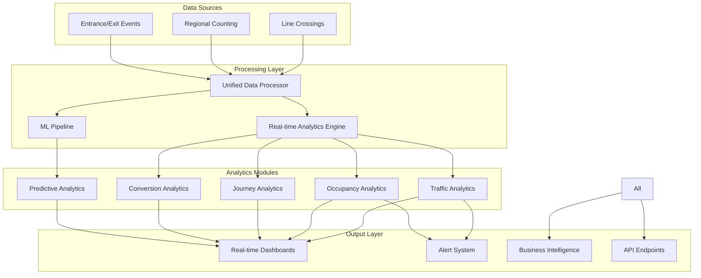

# Unified Analytics System - Complete Implementation Guide

## Overview

This document provides a comprehensive, store-agnostic analytics system that unifies:
- **People Counting** (Line crossing analytics)
- **Regional Analytics** (Zone occupancy and behavior)
- **Entrance/Exit Tracking** (Flow and journey analytics)

The system is designed to work with any retail environment and scales from single stores to enterprise chains.

## Table of Contents

1. [System Architecture](#system-architecture)
2. [Unified Data Model](#unified-data-model)
3. [Analytics Framework](#analytics-framework)
4. [Implementation Modules](#implementation-modules)
5. [Business Use Cases](#business-use-cases)
6. [Dashboard Design](#dashboard-design)
7. [Implementation Plan](#implementation-plan)
8. [ROI Analysis](#roi-analysis)

## System Architecture

### Integrated Components



## Unified Data Model

### Core Concepts

```typescript
interface UnifiedAnalyticsConfig {
  store: StoreConfiguration
  sensors: SensorConfiguration[]
  analytics: AnalyticsModules
  businessRules: BusinessRuleSet
}

interface StoreConfiguration {
  id: string
  type: 'retail' | 'supermarket' | 'department' | 'specialty' | 'custom'
  layout: StoreLayout
  businessModel: BusinessModel
  operatingHours: OperatingSchedule
  capacityLimits: CapacityConfiguration
}

interface SensorConfiguration {
  id: string
  type: 'milesight' | 'axis' | 'hikvision' | 'custom'
  capabilities: {
    lineCrossing: boolean
    regionalCounting: boolean
    entranceExit: boolean
    heatMapping: boolean
  }
  lines: LineConfiguration[]
  regions: RegionConfiguration[]
}
```

### Line Configuration Framework

```typescript
interface LineConfiguration {
  lineNumber: number // Physical line on camera (1-4)
  lineType: 'entrance' | 'exit' | 'bidirectional' | 'monitoring' | 'custom'
  businessPurpose: string
  direction: 'in' | 'out' | 'both'
  
  // Flexible mapping based on store needs
  mapping: {
    zone?: string // Which zone this line belongs to
    function?: 'store_entry' | 'department_entry' | 'checkout' | 'passing_traffic' | 'custom'
    conversionSignal?: boolean // Does crossing indicate purchase intent?
    staffingTrigger?: boolean // Should trigger staffing alerts?
  }
  
  metrics: LineMetrics
  thresholds: LineThresholds
}

// Example configurations for different scenarios
const lineConfigurationTemplates = {
  // Standard retail with passing traffic
  retailWithStreetfront: [
    {
      lineNumber: 1,
      lineType: 'entrance',
      businessPurpose: 'Main store entrance',
      function: 'store_entry',
      metrics: ['entries', 'exits', 'peak_times', 'conversion_contribution']
    },
    {
      lineNumber: 2,
      lineType: 'bidirectional',
      businessPurpose: 'Department entrance',
      function: 'department_entry',
      metrics: ['department_interest', 'cross_selling_potential']
    },
    {
      lineNumber: 3,
      lineType: 'exit',
      businessPurpose: 'Emergency/staff exit',
      function: 'custom',
      metrics: ['usage_frequency', 'unauthorized_use']
    },
    {
      lineNumber: 4,
      lineType: 'monitoring',
      businessPurpose: 'Storefront passing traffic',
      function: 'passing_traffic',
      metrics: ['capture_rate', 'window_effectiveness', 'traffic_patterns']
    }
  ],
  
  // Department store with multiple levels
  departmentStore: [
    {
      lineNumber: 1,
      lineType: 'entrance',
      businessPurpose: 'Ground floor entrance',
      metrics: ['total_traffic', 'floor_distribution']
    },
    {
      lineNumber: 2,
      lineType: 'bidirectional',
      businessPurpose: 'Escalator/elevator area',
      metrics: ['vertical_flow', 'floor_preferences']
    },
    {
      lineNumber: 3,
      lineType: 'bidirectional',
      businessPurpose: 'Premium section entrance',
      metrics: ['premium_interest', 'conversion_quality']
    },
    {
      lineNumber: 4,
      lineType: 'exit',
      businessPurpose: 'Checkout exit',
      metrics: ['purchase_confirmation', 'bag_rate']
    }
  ]
}
```

### Unified Region Model

```typescript
interface UnifiedRegion {
  physical: {
    sensorId: string
    regionNumber: number // 1-4 on camera
    boundaries: Coordinates[]
  }
  
  logical: {
    zoneId: string // Business zone identifier
    zoneName: string
    zoneType: ZoneType
    parentZone?: string // For hierarchical zones
    relatedZones: string[] // Adjacent or connected zones
  }
  
  business: {
    purpose: string
    revenue_contribution?: number
    cost_center?: string
    manager_responsible?: string
  }
  
  analytics: {
    primaryMetrics: string[]
    secondaryMetrics: string[]
    kpis: KPIDefinition[]
    benchmarks: BenchmarkSet
  }
}

// Zone type definitions that work across store types
enum ZoneType {
  // Universal zones
  ENTRANCE = 'entrance',
  EXIT = 'exit',
  TRANSITION = 'transition',
  
  // Shopping zones
  BROWSING = 'browsing',
  CONSIDERATION = 'consideration',
  DECISION = 'decision',
  
  // Service zones
  QUEUE = 'queue',
  SERVICE = 'service',
  WAITING = 'waiting',
  
  // Specialized zones
  PROMOTION = 'promotion',
  PREMIUM = 'premium',
  CLEARANCE = 'clearance',
  SEASONAL = 'seasonal',
  
  // Custom
  CUSTOM = 'custom'
}
```

## Analytics Framework

### 1. Traffic Analytics Module

```typescript
class UnifiedTrafficAnalytics {
  constructor(private config: UnifiedAnalyticsConfig) {
    this.initializeProcessors()
  }
  
  async analyzeTraffic(timeRange: TimeRange): Promise<TrafficAnalysis> {
    // Combine data from all sources
    const lineData = await this.getLineCrossingData(timeRange)
    const regionalData = await this.getRegionalData(timeRange)
    const entranceExitData = await this.getEntranceExitData(timeRange)
    
    return {
      overview: this.calculateTrafficOverview(lineData, regionalData, entranceExitData),
      patterns: this.identifyTrafficPatterns(lineData),
      flows: this.analyzeTrafficFlows(entranceExitData),
      predictions: this.predictTrafficTrends(lineData, regionalData),
      insights: this.generateTrafficInsights(allData),
      recommendations: this.generateTrafficRecommendations(allData)
    }
  }
  
  calculateStoreTraffic(lines: LineData[]): StoreTrafficMetrics {
    // Intelligent traffic calculation based on line configuration
    const config = this.config.sensors[0].lines
    
    let storeEntries = 0
    let storeExits = 0
    let passingTraffic = 0
    let departmentTraffic = new Map<string, number>()
    
    lines.forEach(line => {
      const lineConfig = config.find(c => c.lineNumber === line.lineNumber)
      
      switch(lineConfig?.mapping.function) {
        case 'store_entry':
          storeEntries += line.in
          storeExits += line.out
          break
          
        case 'department_entry':
          const dept = lineConfig.mapping.zone || 'unknown'
          departmentTraffic.set(dept, (departmentTraffic.get(dept) || 0) + line.in)
          break
          
        case 'passing_traffic':
          passingTraffic += line.in + line.out
          break
      }
    })
    
    return {
      grossTraffic: storeEntries,
      netTraffic: storeEntries - storeExits,
      currentOccupancy: this.calculateOccupancy(storeEntries, storeExits),
      captureRate: passingTraffic > 0 ? (storeEntries / passingTraffic) * 100 : 0,
      departmentDistribution: Object.fromEntries(departmentTraffic),
      peakHour: this.findPeakTrafficHour(lines),
      averageVisitDuration: this.calculateAverageVisitDuration(entranceExitData)
    }
  }
  
  identifyTrafficPatterns(data: LineData[]): TrafficPattern[] {
    const patterns = []
    
    // Peak pattern detection
    const hourlyTraffic = this.aggregateByHour(data)
    const peaks = this.findPeaks(hourlyTraffic)
    
    patterns.push({
      type: 'peak_hours',
      description: 'Identified peak traffic periods',
      data: peaks,
      businessImpact: 'Staff scheduling optimization opportunity',
      recommendations: this.generatePeakHourRecommendations(peaks)
    })
    
    // Flow pattern detection
    const flowPatterns = this.analyzeFlowPatterns(data)
    if (flowPatterns.reversedFlow) {
      patterns.push({
        type: 'reversed_flow',
        description: 'Unusual exit/entry pattern detected',
        severity: 'medium',
        recommendation: 'Check for navigation issues or special events'
      })
    }
    
    // Capture rate patterns
    const captureVariation = this.analyzeCaptureRateVariation(data)
    if (captureVariation.cv > 0.3) {
      patterns.push({
        type: 'inconsistent_capture',
        description: 'High variation in capture rate',
        data: captureVariation,
        recommendation: 'Review window displays and entrance visibility'
      })
    }
    
    return patterns
  }
}
```

### 2. Occupancy Analytics Module

```typescript
class UnifiedOccupancyAnalytics {
  private occupancyCache: Map<string, OccupancyState> = new Map()
  
  calculateRealTimeOccupancy(): StoreOccupancy {
    const now = new Date()
    
    // Get all zones/regions
    const zones = this.config.store.layout.zones
    const zoneOccupancy = new Map<string, number>()
    
    // Calculate occupancy for each zone
    zones.forEach(zone => {
      const occupancy = this.calculateZoneOccupancy(zone)
      zoneOccupancy.set(zone.id, occupancy)
    })
    
    // Calculate store-wide occupancy
    const storeTotal = Array.from(zoneOccupancy.values()).reduce((a, b) => a + b, 0)
    
    return {
      timestamp: now,
      total: storeTotal,
      byZone: Object.fromEntries(zoneOccupancy),
      utilizationRate: storeTotal / this.config.store.capacityLimits.total,
      distribution: this.calculateOccupancyDistribution(zoneOccupancy),
      alerts: this.checkOccupancyAlerts(storeTotal, zoneOccupancy),
      trend: this.calculateOccupancyTrend(),
      prediction: this.predictNextHourOccupancy()
    }
  }
  
  calculateZoneOccupancy(zone: Zone): number {
    // Combine multiple data sources for accurate occupancy
    
    // Method 1: Line crossing calculation
    const lineCrossingOccupancy = this.getLineCrossingOccupancy(zone)
    
    // Method 2: Regional counting (if available)
    const regionalCountOccupancy = this.getRegionalCountOccupancy(zone)
    
    // Method 3: Entrance/Exit tracking
    const entranceExitOccupancy = this.getEntranceExitOccupancy(zone)
    
    // Intelligent combination based on available data and confidence
    return this.combineOccupancyEstimates([
      { value: lineCrossingOccupancy, confidence: 0.7, source: 'lines' },
      { value: regionalCountOccupancy, confidence: 0.9, source: 'regions' },
      { value: entranceExitOccupancy, confidence: 0.8, source: 'entranceExit' }
    ])
  }
  
  predictOccupancyTrends(): OccupancyPrediction {
    // ML-based prediction using historical patterns
    const features = this.extractOccupancyFeatures()
    const model = this.occupancyPredictionModel
    
    const predictions = []
    for (let i = 1; i <= 4; i++) {
      const futureFeatures = this.projectFeatures(features, i * 15) // 15-min intervals
      const prediction = model.predict(futureFeatures)
      
      predictions.push({
        time: new Date(Date.now() + i * 15 * 60 * 1000),
        predicted: prediction.value,
        confidence: prediction.confidence,
        bounds: prediction.confidenceInterval
      })
    }
    
    return {
      predictions,
      peakTime: this.findPredictedPeak(predictions),
      recommendations: this.generateOccupancyRecommendations(predictions)
    }
  }
}
```

### 3. Journey Analytics Module

```typescript
class UnifiedJourneyAnalytics {
  analyzeCustomerJourneys(timeRange: TimeRange): JourneyAnalysis {
    const journeys = this.extractJourneys(timeRange)
    
    return {
      overview: this.calculateJourneyOverview(journeys),
      patterns: this.identifyJourneyPatterns(journeys),
      funnels: this.buildConversionFunnels(journeys),
      segments: this.segmentJourneys(journeys),
      insights: this.generateJourneyInsights(journeys)
    }
  }
  
  extractJourneys(timeRange: TimeRange): Journey[] {
    // Combine line crossings and entrance/exit events to build journeys
    const events = this.getAllEvents(timeRange)
    const journeys: Journey[] = []
    const activeJourneys = new Map<string, JourneyBuilder>()
    
    events.forEach(event => {
      const personId = this.identifyPerson(event)
      
      if (!activeJourneys.has(personId)) {
        activeJourneys.set(personId, new JourneyBuilder(personId))
      }
      
      const journey = activeJourneys.get(personId)!
      journey.addEvent(event)
      
      if (this.isJourneyComplete(journey)) {
        journeys.push(journey.build())
        activeJourneys.delete(personId)
      }
    })
    
    return journeys
  }
  
  identifyJourneyPatterns(journeys: Journey[]): JourneyPattern[] {
    const patterns = []
    
    // Common path analysis
    const pathFrequency = this.calculatePathFrequency(journeys)
    const commonPaths = this.extractCommonPaths(pathFrequency, 0.1) // 10% threshold
    
    patterns.push({
      type: 'common_paths',
      description: 'Most frequent customer paths',
      paths: commonPaths,
      insights: this.analyzePathEfficiency(commonPaths)
    })
    
    // Conversion path analysis
    const conversionPaths = journeys.filter(j => j.converted)
    const conversionPatterns = this.analyzeConversionPaths(conversionPaths)
    
    patterns.push({
      type: 'conversion_paths',
      description: 'Paths that lead to purchase',
      data: conversionPatterns,
      optimization: this.suggestPathOptimizations(conversionPatterns)
    })
    
    // Abandonment analysis
    const abandonmentPoints = this.findAbandonmentPoints(journeys)
    patterns.push({
      type: 'abandonment_points',
      description: 'Where customers leave without converting',
      locations: abandonmentPoints,
      recommendations: this.generateAbandonmentSolutions(abandonmentPoints)
    })
    
    return patterns
  }
  
  buildConversionFunnels(journeys: Journey[]): ConversionFunnel[] {
    // Build multiple funnels based on journey types
    const funnels = []
    
    // Standard purchase funnel
    funnels.push(this.buildStandardFunnel(journeys))
    
    // Department-specific funnels
    const departments = this.extractDepartments(journeys)
    departments.forEach(dept => {
      funnels.push(this.buildDepartmentFunnel(journeys, dept))
    })
    
    // Time-based funnels
    funnels.push(this.buildQuickShopFunnel(journeys))
    funnels.push(this.buildBrowsingFunnel(journeys))
    
    return funnels
  }
}
```

### 4. Conversion Analytics Module

```typescript
class UnifiedConversionAnalytics {
  calculateConversions(config: ConversionConfig): ConversionMetrics {
    // Flexible conversion definition based on business model
    const conversions = this.identifyConversions(config)
    
    return {
      overall: this.calculateOverallConversion(conversions),
      bySource: this.calculateSourceConversions(conversions),
      byPath: this.calculatePathConversions(conversions),
      byZone: this.calculateZoneConversions(conversions),
      byTime: this.calculateTemporalConversions(conversions),
      quality: this.assessConversionQuality(conversions)
    }
  }
  
  identifyConversions(config: ConversionConfig): Conversion[] {
    const conversions = []
    
    // Define conversion based on business type
    const conversionRules = this.getConversionRules(config.businessType)
    
    // Process all journeys
    const journeys = this.getJourneys(config.timeRange)
    
    journeys.forEach(journey => {
      const conversionType = this.evaluateConversion(journey, conversionRules)
      
      if (conversionType) {
        conversions.push({
          journeyId: journey.id,
          type: conversionType,
          value: this.calculateConversionValue(journey, conversionType),
          quality: this.assessConversionQuality(journey),
          attribution: this.attributeConversion(journey),
          metadata: this.extractConversionMetadata(journey)
        })
      }
    })
    
    return conversions
  }
  
  getConversionRules(businessType: string): ConversionRule[] {
    const rules = {
      retail: [
        {
          name: 'purchase',
          condition: (j) => j.zones.includes('checkout') && j.exitAfterCheckout,
          value: 'transaction'
        },
        {
          name: 'high_engagement',
          condition: (j) => j.totalDwellTime > 1200 && j.zonesVisited >= 3,
          value: 'qualified_lead'
        }
      ],
      
      service: [
        {
          name: 'service_completed',
          condition: (j) => j.zones.includes('service_area') && j.dwellTime.service > 300,
          value: 'service'
        }
      ],
      
      showroom: [
        {
          name: 'qualified_interest',
          condition: (j) => j.interactions > 0 || j.dwellTime.premium > 180,
          value: 'lead'
        }
      ]
    }
    
    return rules[businessType] || rules.retail
  }
  
  calculateMicroConversions(): MicroConversion[] {
    // Track smaller conversion events that indicate progress
    return [
      {
        name: 'entered_high_value_zone',
        count: this.countZoneEntries('premium'),
        conversionRate: this.calculateMicroConversionRate('premium'),
        value: 'engagement'
      },
      {
        name: 'viewed_promotion',
        count: this.countPromotionViews(),
        conversionRate: this.calculatePromotionEffectiveness(),
        value: 'awareness'
      },
      {
        name: 'compared_products',
        count: this.countProductComparisons(),
        conversionRate: this.calculateComparisonConversion(),
        value: 'consideration'
      }
    ]
  }
}
```

### 5. Predictive Analytics Module

```typescript
class UnifiedPredictiveAnalytics {
  private models: Map<string, MLModel> = new Map()
  
  async generatePredictions(horizon: number): Promise<PredictionSet> {
    return {
      traffic: await this.predictTraffic(horizon),
      occupancy: await this.predictOccupancy(horizon),
      conversions: await this.predictConversions(horizon),
      staffing: await this.predictStaffingNeeds(horizon),
      anomalies: await this.predictAnomalies(horizon)
    }
  }
  
  async predictTraffic(horizon: number): Promise<TrafficPrediction> {
    const features = await this.extractTrafficFeatures()
    const model = this.models.get('traffic')!
    
    const predictions = []
    for (let i = 0; i < horizon; i += 15) {
      const futureFeatures = this.projectFeatures(features, i)
      const prediction = await model.predict(futureFeatures)
      
      predictions.push({
        timestamp: new Date(Date.now() + i * 60 * 1000),
        entries: prediction.entries,
        exits: prediction.exits,
        passingTraffic: prediction.passing,
        confidence: prediction.confidence,
        factors: this.explainPrediction(prediction)
      })
    }
    
    return {
      predictions,
      peakTimes: this.identifyPredictedPeaks(predictions),
      recommendations: this.generateTrafficRecommendations(predictions)
    }
  }
  
  async predictStaffingNeeds(horizon: number): Promise<StaffingPrediction> {
    // Combine multiple factors for staffing predictions
    const trafficPrediction = await this.predictTraffic(horizon)
    const occupancyPrediction = await this.predictOccupancy(horizon)
    const conversionPrediction = await this.predictConversions(horizon)
    
    const staffingNeeds = []
    
    for (let i = 0; i < horizon; i += 30) {
      const timeSlot = new Date(Date.now() + i * 60 * 1000)
      
      // Calculate staffing need for each zone
      const zoneNeeds = this.config.store.layout.zones.map(zone => {
        const traffic = this.getZoneTraffic(zone, timeSlot, trafficPrediction)
        const occupancy = this.getZoneOccupancy(zone, timeSlot, occupancyPrediction)
        const conversionPotential = this.getConversionPotential(zone, timeSlot, conversionPrediction)
        
        return {
          zoneId: zone.id,
          zoneName: zone.name,
          requiredStaff: this.calculateRequiredStaff(traffic, occupancy, conversionPotential),
          priority: this.calculateStaffingPriority(zone, timeSlot),
          skills: this.determineRequiredSkills(zone, timeSlot)
        }
      })
      
      staffingNeeds.push({
        timeSlot,
        totalRequired: zoneNeeds.reduce((sum, z) => sum + z.requiredStaff, 0),
        byZone: zoneNeeds,
        confidence: this.calculateStaffingConfidence(predictions)
      })
    }
    
    return {
      needs: staffingNeeds,
      optimization: this.optimizeStaffingSchedule(staffingNeeds),
      alerts: this.generateStaffingAlerts(staffingNeeds),
      cost: this.calculateStaffingCost(staffingNeeds)
    }
  }
}
```

## Implementation Modules

### 1. Real-time Processing Pipeline

```typescript
class UnifiedDataProcessor {
  private eventStream = new EventEmitter()
  private processors: DataProcessor[] = []
  
  async processIncomingData(data: SensorData) {
    // Identify data type and route accordingly
    const dataType = this.identifyDataType(data)
    
    // Pre-process and validate
    const validated = await this.validateData(data)
    if (!validated.isValid) {
      return this.handleInvalidData(data, validated.errors)
    }
    
    // Enrich with context
    const enriched = await this.enrichData(validated.data)
    
    // Process through appropriate pipelines
    const results = await Promise.all(
      this.processors
        .filter(p => p.canProcess(dataType))
        .map(p => p.process(enriched))
    )
    
    // Emit events for real-time updates
    this.emitProcessedData(results)
    
    // Store for historical analysis
    await this.storeProcessedData(results)
    
    // Check for immediate actions needed
    await this.checkImmediateActions(results)
  }
  
  private enrichData(data: any): any {
    return {
      ...data,
      metadata: {
        processingTime: new Date(),
        storeContext: this.getStoreContext(),
        businessContext: this.getBusinessContext(),
        externalFactors: this.getExternalFactors()
      }
    }
  }
  
  private async checkImmediateActions(results: ProcessingResult[]) {
    const actions = []
    
    results.forEach(result => {
      // Check for alerts
      if (result.alerts && result.alerts.length > 0) {
        actions.push(...result.alerts.map(a => this.createAction(a)))
      }
      
      // Check for automated responses
      if (result.automatedActions) {
        actions.push(...result.automatedActions)
      }
      
      // Check for notifications
      if (result.notifications) {
        actions.push(...result.notifications.map(n => this.createNotification(n)))
      }
    })
    
    // Execute actions in priority order
    await this.executeActions(actions.sort((a, b) => b.priority - a.priority))
  }
}
```

### 2. Alert and Action System

```typescript
class UnifiedAlertSystem {
  private rules: AlertRule[] = []
  private actions: Map<string, ActionHandler> = new Map()
  
  async evaluateAlerts(data: AnalyticsData): Promise<Alert[]> {
    const triggeredAlerts = []
    
    for (const rule of this.rules) {
      if (await rule.evaluate(data)) {
        const alert = this.createAlert(rule, data)
        triggeredAlerts.push(alert)
        
        // Execute immediate actions
        if (rule.immediateActions) {
          await this.executeImmediateActions(alert, rule.immediateActions)
        }
      }
    }
    
    return triggeredAlerts
  }
  
  // Predefined alert rules for common scenarios
  private defaultRules = {
    // Traffic alerts
    suddenTrafficDrop: {
      condition: (data) => data.traffic.dropPercentage > 30,
      severity: 'medium',
      message: 'Sudden traffic drop detected',
      actions: ['investigate_entrance', 'check_competition']
    },
    
    // Occupancy alerts
    overcrowding: {
      condition: (data) => data.occupancy.rate > 0.9,
      severity: 'high',
      message: 'Store approaching capacity',
      actions: ['implement_crowd_control', 'open_additional_exits']
    },
    
    // Conversion alerts
    conversionDrop: {
      condition: (data) => data.conversion.rate < data.conversion.baseline * 0.8,
      severity: 'medium',
      message: 'Conversion rate below baseline',
      actions: ['deploy_sales_staff', 'check_inventory', 'review_pricing']
    },
    
    // Queue alerts
    longQueues: {
      condition: (data) => data.queues.avgWaitTime > 600,
      severity: 'high',
      message: 'Queue wait time exceeding 10 minutes',
      actions: ['open_additional_checkouts', 'deploy_queue_busters']
    },
    
    // Predictive alerts
    predictedRush: {
      condition: (data) => data.predictions.traffic.spike > 1.5,
      severity: 'info',
      message: 'Traffic spike predicted in next hour',
      actions: ['prepare_staff', 'ensure_inventory', 'prepare_queues']
    }
  }
  
  async executeImmediateActions(alert: Alert, actions: string[]) {
    for (const actionName of actions) {
      const handler = this.actions.get(actionName)
      if (handler) {
        try {
          await handler.execute(alert)
        } catch (error) {
          console.error(`Failed to execute action ${actionName}:`, error)
        }
      }
    }
  }
}
```

### 3. Business Intelligence Integration

```typescript
class UnifiedBusinessIntelligence {
  generateExecutiveReport(timeRange: TimeRange): ExecutiveReport {
    const analytics = this.gatherAllAnalytics(timeRange)
    
    return {
      summary: this.generateExecutiveSummary(analytics),
      kpis: this.calculateKPIs(analytics),
      trends: this.analyzeTrends(analytics),
      comparisons: this.generateComparisons(analytics),
      insights: this.extractKeyInsights(analytics),
      recommendations: this.prioritizeRecommendations(analytics),
      roi: this.calculateROI(analytics)
    }
  }
  
  calculateKPIs(analytics: UnifiedAnalytics): KPISet {
    return {
      // Traffic KPIs
      traffic: {
        totalVisitors: analytics.traffic.total,
        growth: this.calculateGrowth(analytics.traffic),
        captureRate: analytics.traffic.captureRate,
        peakUtilization: analytics.traffic.peakOccupancy / this.config.capacity
      },
      
      // Conversion KPIs
      conversion: {
        rate: analytics.conversion.overall,
        value: analytics.conversion.averageValue,
        quality: analytics.conversion.qualityScore,
        trend: analytics.conversion.trend
      },
      
      // Operational KPIs
      operational: {
        staffEfficiency: analytics.staff.customersPerHour,
        queueEfficiency: 1 - (analytics.queues.avgWaitTime / 600),
        spaceUtilization: analytics.occupancy.avgUtilization,
        energyPerVisitor: analytics.operational.energyUse / analytics.traffic.total
      },
      
      // Financial KPIs
      financial: {
        revenuePerVisitor: analytics.revenue.total / analytics.traffic.total,
        revenuePerSqM: analytics.revenue.total / this.config.area,
        conversionValue: analytics.conversion.totalValue,
        costPerConversion: analytics.costs.total / analytics.conversion.count
      }
    }
  }
  
  extractKeyInsights(analytics: UnifiedAnalytics): Insight[] {
    const insights = []
    
    // AI-powered insight generation
    const patterns = this.mlInsightEngine.analyze(analytics)
    
    patterns.forEach(pattern => {
      insights.push({
        type: pattern.type,
        title: this.generateInsightTitle(pattern),
        description: this.generateInsightDescription(pattern),
        impact: this.assessBusinessImpact(pattern),
        confidence: pattern.confidence,
        actions: this.generateActionableSteps(pattern),
        expectedOutcome: this.predictOutcome(pattern)
      })
    })
    
    // Sort by business impact
    return insights.sort((a, b) => b.impact.value - a.impact.value)
  }
}
```

## Business Use Cases

### Use Case 1: Dynamic Store Operations

```typescript
class DynamicStoreOperations {
  async optimizeOperations(): Promise<OperationalPlan> {
    const currentState = await this.getCurrentState()
    const predictions = await this.getPredictions(4) // 4 hours ahead
    
    return {
      immediate: this.planImmediateActions(currentState),
      hourly: this.planHourlyAdjustments(predictions),
      staffing: this.optimizeStaffing(currentState, predictions),
      layout: this.suggestLayoutAdjustments(currentState),
      promotions: this.recommendPromotions(currentState, predictions)
    }
  }
  
  private planImmediateActions(state: StoreState): Action[] {
    const actions = []
    
    // Check each zone
    state.zones.forEach(zone => {
      // Overcrowding
      if (zone.occupancyRate > 0.85) {
        actions.push({
          type: 'crowd_control',
          zone: zone.id,
          action: 'deploy_staff',
          urgency: 'high',
          reason: `${zone.name} at ${Math.round(zone.occupancyRate * 100)}% capacity`
        })
      }
      
      // Underutilization
      if (zone.occupancyRate < 0.1 && zone.type === 'premium') {
        actions.push({
          type: 'attraction',
          zone: zone.id,
          action: 'activate_promotion',
          urgency: 'medium',
          reason: `Low traffic in high-value ${zone.name}`
        })
      }
      
      // Queue management
      if (zone.type === 'checkout' && zone.queueLength > 8) {
        actions.push({
          type: 'queue_management',
          zone: zone.id,
          action: 'open_express_lane',
          urgency: 'high',
          reason: 'Queue exceeding comfortable length'
        })
      }
    })
    
    return actions
  }
}
```

### Use Case 2: Customer Experience Optimization

```typescript
class CustomerExperienceOptimizer {
  analyzeAndOptimize(): ExperienceOptimization {
    const journeys = this.getRecentJourneys()
    const feedback = this.getCustomerFeedback()
    
    return {
      frictionPoints: this.identifyFrictionPoints(journeys),
      delightMoments: this.identifyDelightMoments(journeys, feedback),
      personalization: this.generatePersonalizationStrategy(journeys),
      improvements: this.prioritizeImprovements(frictionPoints),
      experiments: this.designExperiments(improvements)
    }
  }
  
  identifyFrictionPoints(journeys: Journey[]): FrictionPoint[] {
    const frictionPoints = []
    
    // Long dwell without conversion
    const stalledVisitors = journeys.filter(j => 
      j.totalDwellTime > 1800 && !j.converted
    )
    
    if (stalledVisitors.length > journeys.length * 0.1) {
      frictionPoints.push({
        type: 'decision_paralysis',
        severity: 'high',
        location: this.findCommonStallPoint(stalledVisitors),
        impact: stalledVisitors.length,
        solution: 'Deploy personal shoppers or decision aids'
      })
    }
    
    // Backtracking patterns
    const backtrackingJourneys = journeys.filter(j =>
      this.hasBacktracking(j.path)
    )
    
    if (backtrackingJourneys.length > journeys.length * 0.15) {
      frictionPoints.push({
        type: 'navigation_confusion',
        severity: 'medium',
        location: this.findBacktrackingHotspots(backtrackingJourneys),
        impact: backtrackingJourneys.length,
        solution: 'Improve signage and wayfinding'
      })
    }
    
    // Queue abandonment
    const queueAbandonments = this.findQueueAbandonments(journeys)
    if (queueAbandonments.rate > 0.05) {
      frictionPoints.push({
        type: 'queue_frustration',
        severity: 'high',
        location: 'checkout',
        impact: queueAbandonments.count,
        solution: 'Implement virtual queuing or mobile checkout'
      })
    }
    
    return frictionPoints
  }
}
```

### Use Case 3: Revenue Optimization

```typescript
class RevenueOptimizer {
  optimizeRevenue(): RevenueStrategy {
    const analytics = this.getComprehensiveAnalytics()
    
    return {
      pricing: this.optimizePricing(analytics),
      placement: this.optimizeProductPlacement(analytics),
      promotions: this.optimizePromotions(analytics),
      staffing: this.optimizeStaffAllocation(analytics),
      layout: this.optimizeStoreLayout(analytics)
    }
  }
  
  optimizeProductPlacement(analytics: UnifiedAnalytics): PlacementStrategy {
    // Analyze zone performance
    const zonePerformance = analytics.zones.map(zone => ({
      zoneId: zone.id,
      traffic: zone.totalTraffic,
      dwellTime: zone.avgDwellTime,
      conversionRate: zone.conversionRate,
      revenuePerVisitor: zone.revenue / zone.visitors,
      score: this.calculateZoneScore(zone)
    }))
    
    // Sort zones by performance
    const rankedZones = zonePerformance.sort((a, b) => b.score - a.score)
    
    return {
      highPerformanceZones: rankedZones.slice(0, 3).map(z => ({
        zoneId: z.zoneId,
        recommendation: 'Place high-margin products here',
        expectedLift: this.calculateExpectedLift(z, 'high-margin')
      })),
      
      improvementZones: rankedZones.slice(-3).map(z => ({
        zoneId: z.zoneId,
        issue: this.diagnoseZoneIssue(z),
        recommendation: this.generateZoneImprovement(z),
        expectedLift: this.calculateExpectedLift(z, 'improvement')
      })),
      
      crossSellingOpportunities: this.findCrossSellingOpportunities(analytics),
      
      dynamicPlacements: this.generateDynamicPlacements(analytics)
    }
  }
}
```

## Dashboard Design

### Unified Analytics Dashboard

```typescript
interface UnifiedDashboard {
  // Real-time Overview
  overview: {
    currentOccupancy: OccupancyWidget
    trafficFlow: FlowVisualization
    conversionFunnel: FunnelWidget
    alerts: AlertsPanel
  }
  
  // Detailed Analytics Tabs
  tabs: {
    traffic: TrafficAnalyticsTab
    occupancy: OccupancyAnalyticsTab
    journeys: JourneyAnalyticsTab
    conversions: ConversionAnalyticsTab
    predictions: PredictiveAnalyticsTab
  }
  
  // Business Intelligence
  insights: {
    keyMetrics: KPIGrid
    trends: TrendCharts
    recommendations: ActionableInsights
    experiments: ABTestResults
  }
}

// Responsive widgets that adapt to data availability
interface AdaptiveWidget {
  render(availableData: DataSources): WidgetContent {
    if (availableData.hasRegionalCounting) {
      return this.renderWithRegionalData()
    } else if (availableData.hasEntranceExit) {
      return this.renderWithEntranceExitData()
    } else {
      return this.renderWithLineData()
    }
  }
}

// Example: Traffic Flow Widget
class TrafficFlowWidget implements AdaptiveWidget {
  render(data: DataSources): WidgetContent {
    const visualization = this.selectVisualization(data)
    
    switch(visualization) {
      case 'sankey':
        return this.renderSankeyDiagram(data)
      case 'heatmap':
        return this.renderHeatMap(data)
      case 'flow_arrows':
        return this.renderFlowArrows(data)
      case 'particle_system':
        return this.renderParticleFlow(data)
    }
  }
}
```

### Mobile Manager App

```typescript
interface MobileManagerDashboard {
  // At-a-glance metrics
  summary: {
    storeHealth: HealthScore // 0-100
    criticalAlerts: Alert[]
    hourlyProgress: ProgressMetrics
    staffStatus: StaffingStatus
  }
  
  // Actionable insights
  actions: {
    immediate: PrioritizedAction[]
    upcoming: ScheduledAction[]
    completed: CompletedAction[]
  }
  
  // Quick controls
  controls: {
    staffing: QuickStaffingControls
    promotions: QuickPromotionControls
    announcements: QuickAnnouncements
  }
  
  // Drill-down capabilities
  details: {
    zones: ZoneDetails[]
    staff: StaffPerformance[]
    issues: ActiveIssues[]
  }
}
```

## Implementation Plan

### Phase 1: Foundation (Week 1-2)

1. **Infrastructure Setup**
   - Deploy unified data collection system
   - Set up real-time processing pipeline
   - Configure database schema
   - Establish API framework

2. **Basic Analytics**
   - Implement traffic counting
   - Set up occupancy tracking
   - Create simple dashboards
   - Enable basic alerts

### Phase 2: Advanced Analytics (Week 3-4)

1. **Journey Analytics**
   - Implement journey extraction
   - Build conversion funnels
   - Create path analysis
   - Enable segmentation

2. **Predictive Capabilities**
   - Train baseline models
   - Implement predictions
   - Create recommendation engine
   - Set up A/B testing

### Phase 3: Business Integration (Week 5-6)

1. **Operational Integration**
   - Connect to POS systems
   - Integrate with staffing
   - Link to inventory
   - Enable marketing automation

2. **Optimization & Training**
   - Fine-tune algorithms
   - Train staff
   - Create playbooks
   - Establish KPIs

## ROI Analysis

### Investment

```yaml
Initial Setup:
  Hardware: $0 (uses existing cameras)
  Software: $15,000
  Integration: $10,000
  Training: $5,000
  Total: $30,000

Monthly Operations:
  Cloud Infrastructure: $500
  Maintenance: $1,000
  Support: $500
  Total: $2,000/month
```

### Returns

```yaml
Monthly Benefits:
  # Traffic Optimization
  Increased Capture Rate (2%): $15,000
  Better Peak Management: $5,000
  
  # Conversion Improvement
  Higher Conversion Rate (1.5%): $20,000
  Reduced Abandonments: $8,000
  
  # Operational Efficiency
  Staff Optimization (20%): $10,000
  Reduced Queues: $5,000
  Energy Savings: $2,000
  
  # Strategic Benefits
  Better Inventory Turns: $10,000
  Improved Customer Satisfaction: $15,000
  
  Total Monthly Benefit: $90,000
```

### ROI Calculation

```
Year 1:
  Investment: $30,000 + ($2,000 × 12) = $54,000
  Returns: $90,000 × 12 = $1,080,000
  Net Benefit: $1,026,000
  ROI: 1,900%
  
Payback Period: 0.6 months
5-Year NPV (10% discount): $3.8M
```

## Success Metrics

### Technical KPIs
- Data processing latency < 500ms
- Dashboard load time < 2s
- Prediction accuracy > 85%
- System uptime > 99.9%

### Business KPIs
- Traffic capture rate improvement: 15-25%
- Conversion rate increase: 10-20%
- Average transaction value growth: 5-15%
- Customer satisfaction improvement: 10+ NPS points
- Staff productivity increase: 20-30%

### Operational KPIs
- Queue time reduction: 40-60%
- Space utilization improvement: 25-35%
- Energy efficiency gain: 15-20%
- Inventory turnover increase: 20-30%

## Conclusion

This unified analytics system provides a complete, scalable solution that grows with your business. By combining line crossing, regional counting, and entrance/exit analytics, it delivers comprehensive insights that drive real business value. The modular architecture allows starting simple and adding sophistication as needed, ensuring positive ROI from day one.