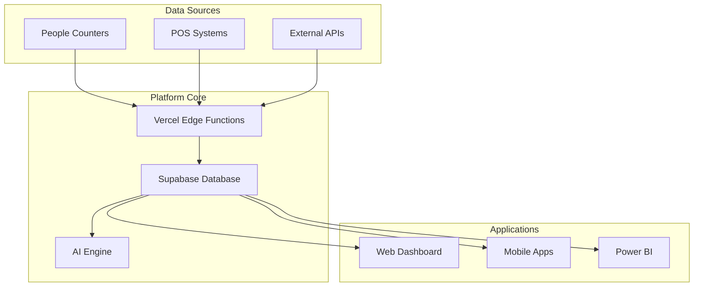

# blipee OS Retail Intelligence

[](https://opensource.org/licenses/MIT)
[](https://github.com/blipee/os-retail-intelligence/releases)
[](https://github.com/blipee/os-retail-intelligence/actions)
[](https://docs.blipee.com/retail-intelligence)

## 🚀 Overview

**blipee OS Retail Intelligence** is an enterprise-grade, AI-powered analytics platform that transforms retail operations through real-time data insights, predictive analytics, and intelligent automation. Built for multi-location retail chains, shopping malls, and retail consultancies by blipee.

### Key Features

- 📊 **Real-time Analytics** - Live foot traffic, sales, and conversion metrics
- 🤖 **AI-Powered Insights** - Predictive analytics and actionable recommendations
- 🎯 **Smart Targets** - Cascading KPIs with real-time tracking
- 📈 **Enterprise Integrations** - Power BI, Dynamics 365, and major POS systems
- 🏢 **Multi-tenant Architecture** - True SaaS with organization isolation
- 🔐 **Enterprise Security** - SOC2 compliant with RBAC and audit trails

## 📚 Documentation

- [Getting Started Guide](./docs/guides/getting-started.md)
- [Architecture Overview](./docs/architecture/overview.md)
- [API Documentation](./docs/api/README.md)
- [Deployment Guide](./docs/deployment/README.md)
- [Security & Compliance](./docs/security/README.md)

## 🏗️ Architecture



## 🚀 Quick Start

### Prerequisites

- Node.js 20+
- npm or yarn
- Supabase account
- Vercel account

### Installation

```bash
# Clone the repository
git clone https://github.com/blipee/os-retail-intelligence.git
cd os-retail-intelligence

# Install dependencies
npm install

# Set up environment variables
cp .env.example .env.local

# Run database migrations
npm run db:migrate

# Start development server
npm run dev
```

### Environment Variables

```env
# Required variables
NEXT_PUBLIC_SUPABASE_URL=your-supabase-url
NEXT_PUBLIC_SUPABASE_ANON_KEY=your-anon-key
SUPABASE_SERVICE_KEY=your-service-key

# See .env.example for complete list
```

## 🧩 Modules

| Module | Description | Status |
|--------|-------------|--------|
| **Authentication** | Multi-tenant auth with SSO | ✅ Stable |
| **People Counting** | Real-time foot traffic analytics | ✅ Stable |
| **Sales Integration** | POS system connectivity | ✅ Stable |
| **Smart Targets** | Cascading KPI management | 🚧 Beta |
| **AI Insights** | Predictive analytics | 🚧 Beta |
| **Benchmarking** | Industry comparisons | 📅 Planned |
| **Power BI** | Enterprise reporting | 🚧 Beta |

## 🛠️ Development

See [CONTRIBUTING.md](./.github/CONTRIBUTING.md) for development guidelines.

### Project Structure

```
blipee-os-retail-intelligence/
├── .github/               # GitHub community files
├── .devcontainer/         # Codespaces configuration
├── docs/                  # Documentation
│   ├── api/              # API documentation
│   ├── guides/           # User guides
│   └── specifications/   # Technical specs
├── src/                   # Source code (to be created)
├── supabase/             # Database & functions
└── tests/                # Test files
```

### Commands

```bash
# Development
npm run dev              # Start development server
npm run build            # Build for production
npm run test             # Run tests
npm run lint             # Lint code
npm run type-check       # Type checking

# Database
npm run db:migrate       # Run migrations
npm run db:seed          # Seed database
npm run db:reset         # Reset database

# Documentation
npm run docs:dev         # Start docs server
npm run docs:build       # Build documentation
```

## 🚀 Deployment

The platform is designed for cloud-first deployment:

- **Frontend**: Vercel
- **Database**: Supabase
- **Edge Functions**: Vercel Edge
- **Storage**: Supabase Storage

See [Deployment Guide](./docs/deployment/README.md) for detailed instructions.

## 🔐 Security

- SOC2 Type II compliant
- GDPR ready
- End-to-end encryption
- Regular security audits

See [Security Documentation](./docs/security/README.md) for details.

## 📊 Performance

- **API Response Time**: < 100ms (p95)
- **Dashboard Load**: < 2s
- **Real-time Latency**: < 1s
- **Uptime SLA**: 99.9%

## 🤝 Contributing

We welcome contributions! Please see [CONTRIBUTING.md](./.github/CONTRIBUTING.md) for guidelines.

## 📄 License

This project is licensed under the MIT License - see [LICENSE](./LICENSE) for details.

## 🆘 Support

- 📧 Email: support@blipee.com
- 💬 Discord: [Join our community](https://discord.gg/blipee)
- 📖 Documentation: [docs.blipee.com](https://docs.blipee.com/retail-intelligence)
- 🐛 Issues: [GitHub Issues](https://github.com/blipee/os-retail-intelligence/issues)

## 🙏 Acknowledgments

Built with:
- [Next.js](https://nextjs.org)
- [Supabase](https://supabase.com)
- [Vercel](https://vercel.com)
- [shadcn/ui](https://ui.shadcn.com)

---

Made with ❤️ by the blipee team